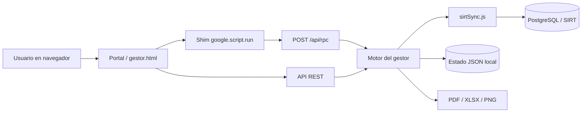

# Colbeef · Gestor de Vísceras

Aplicación web para apoyar la operación diaria del área de vísceras de Colbeef. El sistema consulta información de **SIRT/PostgreSQL**, consolida inventario y salidas, cruza decomisos, controla despachos por turno y muestra el progreso de los operadores logísticos (OPL).

También permite generar informes, planillas, archivos PDF y consultar estadísticas internas de uso.

## Contenido

- [Funciones principales](#funciones-principales)
- [Tecnologías utilizadas](#tecnologías-utilizadas)
- [Arquitectura](#arquitectura)
- [Estructura del repositorio](#estructura-del-repositorio)
- [Requisitos](#requisitos)
- [Instalación](#instalación)
- [Variables de entorno](#variables-de-entorno)
- [Ejecución](#ejecución)
- [Flujo operativo](#flujo-operativo)
- [Reglas de negocio importantes](#reglas-de-negocio-importantes)
- [API](#api)
- [Persistencia local](#persistencia-local)
- [Pruebas y diagnóstico](#pruebas-y-diagnóstico)
- [Despliegue en red local](#despliegue-en-red-local)
- [Servicio de Windows](#servicio-de-windows)
- [Seguridad](#seguridad)
- [Solución de problemas](#solución-de-problemas)
- [Documentación adicional](#documentación-adicional)

## Funciones principales

### Dashboard operativo

- Consulta de la fecha y turno de operación.
- Juegos programados para salir.
- Animales con decomiso asociados a la salida.
- Vísceras blancas crudas programadas.
- Total de juegos a despachar.
- Progreso general y progreso por OPL.
- Totales diarios congelados: permanecen visibles después de despachar y solo aumentan cuando ingresa nueva programación.

### Decomisos

- Consulta directa de decomisos registrados en SIRT/SAI.
- Cruce entre decomisos y productos con salida programada.
- Visualización de:
  - ID del producto.
  - Puesto o destino.
  - Parte decomisada.
- Generación de PDF con detalle de decomisos.
- Resumen de vísceras blancas crudas dentro del PDF.

### Despachos

- Agrupación de productos por puesto y turno.
- Conteo por tipo:
  - Cabeza.
  - Patas y manos.
  - Vísceras blancas.
  - Vísceras rojas.
- Identificación de juegos completos.
- Detalle por puesto, propietario y decomiso.
- Actualización desde la programación disponible en SIRT.

### Progreso OPL

- Agrupación por operador logístico.
- Total de juegos asignados.
- Juegos realmente despachados.
- Juegos pendientes.
- Porcentaje de avance.
- Configuración de excepciones propietario → OPL.

### Módulo de crudas

- Identificación de vísceras blancas marcadas como `CRUDAS`.
- Agrupación por puesto y OPL.
- Cantidad y códigos asociados.
- Visualización del código de puesto en pantalla.
- Uso de la ruta completa del puesto en el PDF de decomisos.

### Informe laboral

- Animales beneficiados.
- Juegos completos e incompletos.
- Novedades por código.
- Ocupación de cavas.
- Capacidad, inventario y participación.
- Disponibilidad de carros percheros.
- Distribución de productos por cava.
- Exportación del informe como imagen PNG.

### Planilla e historial

- Consolidación de puestos por zona y OPL.
- Generación de planilla visual.
- Exportación de planilla.
- Historial de PDF almacenados en el servidor.
- Apertura y descarga desde el navegador.

### Dashboard de usabilidad

- Registro de sesiones y apertura de módulos.
- Usuarios y sesiones únicas.
- Actividad por día.
- Usuarios más activos.
- Módulos más visitados.
- Acciones realizadas.
- Historial de eventos recientes.
- Acceso administrativo protegido mediante contraseña y token temporal.

## Tecnologías utilizadas

### Lenguajes

- **JavaScript** con módulos ES (`type: module`).
- **HTML5**.
- **CSS3**.
- **SQL** para consultas PostgreSQL.
- Scripts auxiliares de **Batch/Windows** para administrar el servicio.

### Backend

- **Node.js**.
- **Express**: servidor HTTP y API REST.
- **pg**: conexión con PostgreSQL/SIRT.
- **dotenv**: variables de entorno.
- **CORS**: acceso desde el cliente web.
- **Multer**: recepción de archivos.
- **PDFKit**: generación de PDF.
- **ExcelJS** y **SheetJS/xlsx**: lectura y exportación de Excel.

### Frontend

- Interfaz operativa principal en HTML, CSS y JavaScript.
- **Vite** para desarrollo y compilación.
- **React 18** para la entrada ligera del portal.
- **Chart.js** para gráficas.
- **html2canvas** para exportar informes visuales.

## Arquitectura



La interfaz principal conserva el patrón de llamadas de Google Apps Script. El archivo `google-script-shim.js` traduce llamadas como:

```javascript
google.script.run.metodo(argumentos);
```

en solicitudes HTTP:

```http
POST /api/rpc
Content-Type: application/json

{
  "method": "metodo",
  "args": []
}
```

### Flujo de datos

1. El usuario selecciona la fecha de operación.
2. El cliente solicita los datos al backend.
3. El backend consulta SIRT mediante SQL parametrizado.
4. `sirtSync.js` transforma los resultados al formato usado por el gestor.
5. `engine.js` aplica las reglas de negocio.
6. La interfaz presenta los indicadores, tablas y reportes.
7. El estado necesario para continuar la operación se persiste localmente.

## Estructura del repositorio

```text
Colbeef-_Gestor-de-V-sceras-1/
├── README.md
├── docs/
│   ├── README.md
│   └── diagrams/
└── colbeef-sirt-app/
    ├── client/
    │   ├── gestor.html
    │   ├── portal.html
    │   ├── usabilidad.html
    │   ├── src/
    │   └── public/
    │       ├── google-script-shim.js
    │       ├── gestor-ux.js
    │       ├── usabilidad-tracker.js
    │       └── vendor/
    ├── server/
    │   ├── index.js
    │   ├── db.js
    │   ├── gestor/
    │   │   ├── engine.js
    │   │   ├── engineUtils.js
    │   │   ├── sirtSync.js
    │   │   ├── informe.js
    │   │   ├── store.js
    │   │   ├── rpc.js
    │   │   ├── usabilityStore.js
    │   │   └── pdfHistorial.js
    │   ├── logic/
    │   ├── services/
    │   └── data/
    ├── scripts/
    ├── package.json
    └── .env.example
```

### Archivos clave

- `client/gestor.html`: interfaz operativa completa.
- `client/portal.html`: identificación del usuario y entrada al gestor.
- `client/usabilidad.html`: dashboard administrativo de usabilidad.
- `server/index.js`: servidor Express, rutas REST y archivos estáticos.
- `server/db.js`: pool de PostgreSQL y control de solo lectura.
- `server/gestor/sirtSync.js`: consultas y transformación de datos SIRT.
- `server/gestor/engine.js`: reglas principales del negocio.
- `server/gestor/informe.js`: informe laboral HTML/PNG.
- `server/gestor/store.js`: persistencia del estado operativo.

## Requisitos

- **Node.js 18 o superior**.
- **npm**.
- Acceso por red al servidor PostgreSQL/SIRT.
- Credenciales con permisos de lectura sobre los esquemas utilizados.
- Puerto `3001` disponible para producción.
- Puerto `5173` disponible para desarrollo con Vite.
- Navegador moderno.
- Windows con permisos de administrador únicamente si se instalará como servicio.

## Instalación

Abra una terminal en la aplicación:

```powershell
cd colbeef-sirt-app
```

Instale las dependencias:

```powershell
npm install
```

Para una instalación reproducible basada en `package-lock.json`:

```powershell
npm ci
```

Copie el archivo de ejemplo:

```powershell
Copy-Item .env.example .env
```

Complete `.env` con los datos del entorno. No publique este archivo en Git.

## Variables de entorno

### PostgreSQL

| Variable | Descripción | Valor habitual |
|---|---|---|
| `POSTGRES_HOST` | Host o IP de PostgreSQL/SIRT | Requerido |
| `POSTGRES_PORT` | Puerto de PostgreSQL | `5432` |
| `POSTGRES_DB` | Base de datos | Requerido |
| `POSTGRES_USER` | Usuario de conexión | Requerido |
| `POSTGRES_PASSWORD` | Contraseña | Requerido |
| `POSTGRES_READ_ONLY` | Bloquea operaciones distintas de `SELECT/WITH` | `true` |
| `POSTGRES_SSL` | Habilita SSL | `false` |
| `POSTGRES_STATEMENT_TIMEOUT_MS` | Tiempo máximo de una consulta | `30000` |

Si la contraseña contiene caracteres especiales, escríbala entre comillas:

```env
POSTGRES_PASSWORD="su_contraseña"
```

### Servidor y red

| Variable | Descripción | Predeterminado |
|---|---|---|
| `SERVER_PORT` | Puerto del backend | `3001` |
| `SERVER_BIND` | Interfaz de escucha | `0.0.0.0` |
| `VITE_PORT` | Puerto del frontend en desarrollo | `5173` |
| `VITE_API_PROXY` | URL del backend usada por Vite | `http://127.0.0.1:3001` |
| `LAN_SHARE_IP` | IP mostrada para compartir el gestor | Automática |
| `PORTAL_RETURN_URL` | Programa principal al que vuelve la flecha superior | Configurable |

Ejemplo:

```env
SERVER_PORT=3001
SERVER_BIND=0.0.0.0
VITE_PORT=5173
LAN_SHARE_IP=192.168.x.x
PORTAL_RETURN_URL=http://192.168.x.x:8501/?session=active
```

### Reglas SIRT

| Variable | Descripción | Predeterminado |
|---|---|---|
| `SIRT_CAVA_LOOKBACK_DAYS` | Ventana de consulta de productos en cava | `30` |
| `SIRT_SALIDAS_CAVA_LOOKBACK_DAYS` | Ventana de salidas físicas | `30` |
| `SIRT_DECOMISO_LOOKBACK_DAYS` | Días consultados para decomisos | `7` |
| `SIRT_PROGRAMACION_REZAGO_DAYS` | Rezago permitido en programación | `21` |
| `SIRT_DESPACHOS_FUENTE` | Fuente de despachos | `programado` |

Valores admitidos para `SIRT_DESPACHOS_FUENTE`:

- `programado`: productos en cava con programación de despacho.
- `erp`: información del despacho de desposte.
- `riel`: salidas físicas que ya tienen `fecha_salida`.

### Usabilidad

| Variable | Descripción |
|---|---|
| `USABILITY_ADMIN_PASSWORD` | Contraseña del dashboard administrativo |

Defina siempre una contraseña propia y segura:

```env
USABILITY_ADMIN_PASSWORD="cambiar_por_una_clave_segura"
```

## Ejecución

### Desarrollo

Ejecute backend y frontend simultáneamente:

```powershell
npm run dev
```

Direcciones:

- Gestor: `http://localhost:5173/gestor.html`
- Portal: `http://localhost:5173/portal.html`
- API: `http://localhost:3001`
- Estado de la API: `http://localhost:3001/api/health`

También pueden iniciarse por separado:

```powershell
npm run dev:server
npm run dev:client
```

### Producción

Construya el frontend:

```powershell
npm run build
```

Inicie Express en modo producción:

```powershell
npm start
```

O ejecute ambos pasos:

```powershell
npm run start:lan
```

Acceso:

```text
http://<IP_DEL_SERVIDOR>:3001/gestor.html
```

## Flujo operativo

Flujo recomendado durante la jornada:

1. Ingresar desde el portal con el nombre del operador.
2. Seleccionar la fecha de operación.
3. Sincronizar o actualizar los datos de SIRT.
4. Revisar el dashboard.
5. Abrir **Decomisos** y validar los registros vinculados.
6. Abrir **Despachos** y procesar la programación del turno.
7. Revisar el progreso OPL.
8. Consultar crudas y planilla cuando corresponda.
9. Completar y generar el informe laboral.
10. Generar el PDF de decomisos y descargarlo desde el historial.

## Reglas de negocio importantes

### Juego completo

Un juego se considera completo cuando el mismo animal tiene:

1. Cabeza.
2. Patas y manos.
3. Vísceras blancas.
4. Vísceras rojas.

### Progreso OPL

| Concepto | Cálculo |
|---|---|
| Pendientes | Juegos completos todavía programados o en cava |
| Despachados | Juegos completos con `fecha_salida` real en SIRT |
| Total | Pendientes + despachados |
| Progreso | `despachados / total × 100` |

El sistema utiliza la salida física registrada en SIRT; retirar físicamente un producto sin registrar `fecha_salida` no incrementa el valor despachado.

### Indicadores diarios congelados

Los indicadores **En cava**, **Decomisos** y **Crudas** conservan el máximo registrado para la fecha y turno:

- No bajan mientras avanza el despacho.
- Aumentan si aparece programación adicional.
- Se reinician cuando cambia la fecha o el turno.

### Crudas

Una víscera blanca se considera cruda cuando su observación cumple la regla definida en el motor, normalmente comenzando por `CRUDAS`.

### Turnos

El turno se determina a partir de la fecha de operación y de las rutas disponibles en SIRT. Entre los valores utilizados están:

```text
DxL, LxM, MxM, MxJ, JxV, VxS, SxD
```

## API

### Infraestructura

| Método | Ruta | Descripción |
|---|---|---|
| `POST` | `/api/rpc` | Puente RPC usado por `gestor.html` |
| `GET` | `/api/health` | Comprueba API y conexión a PostgreSQL |
| `GET` | `/api/info` | Información del servidor y acceso LAN |

### Operación

| Método | Ruta | Descripción |
|---|---|---|
| `GET` | `/api/dashboard` | Indicadores operativos |
| `GET` | `/api/en-cava` | Productos actualmente en cava |
| `GET` | `/api/stock` | Consulta de inventario |
| `GET` | `/api/salidas` | Salidas para una fecha o rango |
| `GET` | `/api/decomisos` | Resumen de decomisos |
| `GET` | `/api/decomisos/detalle` | Detalle SIRT/SAI |
| `POST` | `/api/decomisos/resumir` | Procesa el cruce de decomisos |
| `GET` | `/api/decomisos/pdf` | Genera y descarga el PDF |
| `GET` | `/api/despachos` | Resumen de despachos |
| `POST` | `/api/despachos/procesar` | Procesa despachos |
| `GET` | `/api/despachos/detalle/:puesto` | Detalle de un puesto |
| `GET` | `/api/opl/config` | Consulta configuración OPL |
| `POST` | `/api/opl/config` | Agrega o actualiza configuración |
| `DELETE` | `/api/opl/config/:idx` | Elimina configuración |
| `GET` | `/api/opl/progreso` | Progreso actual |
| `POST` | `/api/opl/calcular` | Recalcula progreso |
| `GET` | `/api/crudas` | Detalle de vísceras blancas crudas |
| `GET` | `/api/planilla` | Consolidado de planilla |
| `POST` | `/api/adicionales` | Importa salidas adicionales |
| `GET` | `/api/historico/pdf` | Historial de PDF |
| `GET` | `/api/historial/pdf/:id` | Abre un PDF almacenado |
| `POST` | `/api/limpiar` | Limpia el estado operativo |

### Exportación

| Método | Ruta | Descripción |
|---|---|---|
| `GET` | `/api/despachos-propietario` | Despachos agrupados por propietario |
| `GET` | `/api/categorias` | Resumen por categoría |
| `GET` | `/api/export/resumen.xlsx` | Exporta resumen en Excel |
| `GET` | `/api/export/resumen.pdf` | Exporta resumen en PDF |

### Usabilidad

| Método | Ruta | Descripción |
|---|---|---|
| `POST` | `/api/usability/event` | Registra un evento |
| `POST` | `/api/usability/login` | Autentica al administrador |
| `GET` | `/api/usability/stats` | Devuelve estadísticas protegidas |
| `GET` | `/api/usability/enlace` | Genera enlace nominal al gestor |

Los endpoints que aceptan fechas utilizan normalmente:

```text
?date=YYYY-MM-DD
```

o:

```text
?from=YYYY-MM-DD&to=YYYY-MM-DD
```

## Persistencia local

La información operativa de SIRT continúa en PostgreSQL. El servidor conserva estado auxiliar en:

```text
colbeef-sirt-app/server/data/
```

Archivos principales:

- `gestor-state.json`: sesión operativa, configuración OPL, informe, baselines e historial.
- `usability-events.json`: telemetría de uso.
- `pdf-historial/`: PDF generados.

Estos archivos no deben usarse como reemplazo de SIRT ni modificarse manualmente mientras el servidor esté activo.

## Pruebas y diagnóstico

Las pruebas actuales son scripts Node.js basados en `node:assert`.

### Comandos de prueba

```powershell
npm run test:decomiso-cruce
npm run test:planilla-opl
npm run test:crudas-despacho
npm run test:despacho-kpi-freeze
npm run test:opl-juego
```

### Inspección de PostgreSQL

```powershell
npm run probe
npm run search-tables
npm run view-def
node scripts/describe-one.mjs esquema.tabla
```

### Diagnóstico especializado

La carpeta `scripts/` contiene utilidades para:

- Revisar columnas y relaciones de decomisos.
- Comparar fechas de registro y salida.
- Diagnosticar el cálculo OPL.
- Verificar datos reales de una fecha.
- Analizar archivos Excel.
- Explorar vistas y tablas SIRT.

Estos scripts pueden consultar datos reales. Ejecútelos únicamente en un entorno autorizado.

## Despliegue en red local

El servidor escucha por defecto en todas las interfaces:

```env
SERVER_BIND=0.0.0.0
```

Para compartirlo:

1. Configure `LAN_SHARE_IP`.
2. Ejecute `npm run start:lan`.
3. Permita el puerto `SERVER_PORT` en el firewall.
4. Abra desde otro equipo:

```text
http://<IP_DEL_SERVIDOR>:3001/gestor.html
```

El acceso requiere conectividad con el servidor de la aplicación y con PostgreSQL/SIRT.

## Servicio de Windows

El proyecto incluye scripts para instalar el backend como servicio:

```powershell
npm run service:install
npm run service:uninstall
```

También están disponibles:

```text
install-service.bat
uninstall-service.bat
start.bat
stop.bat
restart.bat
status.bat
```

La instalación y configuración del firewall deben realizarse desde una terminal con permisos de administrador.

## Seguridad

- Mantenga `.env` fuera del repositorio.
- Use `POSTGRES_READ_ONLY=true` siempre que la operación no requiera escrituras.
- No exponga el servidor directamente a Internet; está diseñado principalmente para una LAN controlada.
- Defina `USABILITY_ADMIN_PASSWORD`; no dependa de valores predeterminados.
- Restrinja el acceso al puerto del servidor mediante firewall.
- No almacene contraseñas, tokens ni información sensible en los eventos de usabilidad.
- Realice copias de seguridad de `server/data/` si necesita conservar configuración e historial.
- El nombre ingresado en el portal identifica al operador, pero no reemplaza un sistema formal de autenticación.

## Solución de problemas

### El backend no inicia

Compruebe:

```powershell
node --version
npm install
npm run dev:server
```

Revise que exista `.env` y que todas las variables obligatorias estén definidas.

### `/api/health` devuelve error

- Verifique host, puerto, base, usuario y contraseña.
- Confirme acceso a la red o VPN de SIRT.
- Revise permisos del usuario PostgreSQL.
- Si la contraseña tiene caracteres especiales, colóquela entre comillas.

### El frontend abre, pero no carga datos

- Confirme que Express esté activo en el puerto `3001`.
- En desarrollo, revise `VITE_API_PROXY`.
- Abra las herramientas del navegador y consulte la pestaña **Network**.
- Verifique la fecha seleccionada y la fuente `SIRT_DESPACHOS_FUENTE`.

### Los despachados OPL permanecen en cero

- Confirme que SIRT tenga `fecha_salida`.
- Verifique que la salida corresponda a la fecha y turno seleccionados.
- Compruebe que estén presentes los cuatro componentes del juego.
- Use **Recalcular ahora** después de sincronizar.

### No se puede acceder desde otro equipo

- Confirme `SERVER_BIND=0.0.0.0`.
- Revise la IP configurada en `LAN_SHARE_IP`.
- Permita el puerto en el firewall de Windows.
- Verifique que ambos equipos estén en la misma red.

### El PDF o informe conserva un diseño anterior

Los archivos existentes no se regeneran automáticamente. Genere un documento nuevo después de desplegar los cambios.

## Documentación adicional

- [Documentación de la aplicación](colbeef-sirt-app/README.md)
- [Índice de diagramas](docs/README.md)
- [Arquitectura general](docs/diagrams/01-arquitectura.md)
- [Endpoints y UI](docs/diagrams/02-endpoints-a-ui.md)
- [Mapa de pantallas](docs/diagrams/03-mapa-pantallas.md)

## Repositorio

[desarrollotecnologia/Colbeef-_Gestor-de-V-sceras](https://github.com/desarrollotecnologia/Colbeef-_Gestor-de-V-sceras)

## Mantenimiento

Antes de modificar reglas de negocio:

1. Documente la fuente SIRT utilizada.
2. Confirme si el cálculo opera por pieza, animal o juego completo.
3. Ejecute las pruebas relacionadas.
4. Valide una fecha real conocida.
5. Actualice este README y los diagramas si cambia la arquitectura.

