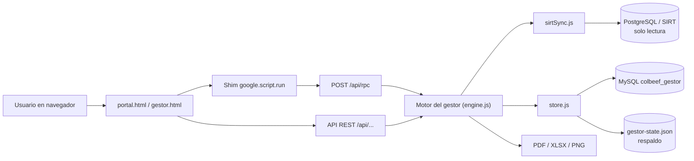

# Colbeef · Gestor de Vísceras

Aplicación web para apoyar la operación diaria del área de vísceras de Colbeef. El sistema consulta información de **SIRT/PostgreSQL** (solo lectura), controla los despachos por turno, calcula el progreso de los operadores logísticos (OPL), separa los juegos adicionales, cruza decomisos y lista las vísceras blancas crudas.

También genera informes, planillas, PDF y archivos Excel, y registra estadísticas internas de uso.

En planta: **http://192.168.20.205:3001/gestor.html**

Última revisión de esta documentación: **30/09/2026**.

## Contenido

- [Funciones principales](#funciones-principales)
- [Tecnologías utilizadas](#tecnologías-utilizadas)
- [Arquitectura](#arquitectura)
- [Estructura del repositorio](#estructura-del-repositorio)
- [Requisitos](#requisitos)
- [Instalación](#instalación)
- [Variables de entorno](#variables-de-entorno)
- [Ejecución](#ejecución)
- [Flujo operativo](#flujo-operativo)
- [Reglas de negocio importantes](#reglas-de-negocio-importantes)
- [API](#api)
- [Persistencia](#persistencia)
- [Pruebas y diagnóstico](#pruebas-y-diagnóstico)
- [Despliegue en el servidor 205](#despliegue-en-el-servidor-205)
- [Servicio de Windows](#servicio-de-windows)
- [Seguridad](#seguridad)
- [Solución de problemas](#solución-de-problemas)
- [Documentación adicional](#documentación-adicional)

## Funciones principales

### Dashboard operativo

- Campo **Fecha operación**: el tablero, la tarjeta OPL y el modal OPL muestran siempre esa fecha. Antes de las 4:00 el día operativo sigue siendo el anterior.
- Tarjeta 1: **En cava**, **Decomisos**, **Crudas** (VB crudas del turno), **Adicionales** (asignados desde las 15:20) e **Incompletos** (salieron sin las 4 piezas; clic para ver el detalle).
- Tarjeta 2: **Progreso OPL** resumido; clic para abrir el modal con el detalle y la configuración.
- Tarjeta 3: **Total juegos a despachar** (todo lo que sigue en cava, adicionales incluidos) y la línea **Antes 15:20 + Adic. = Total asignado**.
- Barra **Progreso de la operación** con la meta, lo salido, los incompletos y lo pendiente.
- La meta de cada fecha queda **congelada**: no baja al despachar y no se pierde al consultar otra fecha.

### Decomisos

- Consulta directa de decomisos registrados en SIRT/SAI.
- Cruce entre decomisos y productos con salida programada (ID, puesto, parte decomisada).
- PDF con el detalle de decomisos y el resumen de crudas; queda guardado en el Historial.

### Despachos

- Carga y proceso de la programación del turno desde SIRT.
- Tabla por puesto con Cabeza, Patas y manos, Vísceras blancas y Vísceras rojas; juegos completos e incompletos.
- Modal de detalle por puesto (propietario, decomisos).
- Panel **Juegos asignados del día**: normales vs adicionales según la hora de asignación, con estado (en cava / salió).
- Detalle línea a línea de la programación SIRT con exportación CSV.

### Progreso OPL

- Modal con **Total · Despachados · Pendientes · Avance** por operador logístico y botón **Recalcular ahora**.
- Pestaña **Configuración** para las excepciones propietario → OPL (por defecto `TRANSCARNES`).
- Los juegos partidos (una pieza salió otro día y el resto sigue en cava) cuentan como pendientes.

### Módulo de crudas

- Vísceras blancas marcadas como `CRUDAS` **asignadas al turno del día** (mismo número que la tarjeta del tablero).
- Tabla por puesto y OPL con cantidad y códigos; buscador.
- **Descargar Excel por OPL**: hoja Resumen + una hoja por OPL (Puesto · Cantidad · Códigos).
- **Descargar Excel general**: una sola hoja (OPL · Puesto · Cantidad · Códigos) en orden de OPL y puesto.
- Ambos Excel traen títulos en verde, filtros en cada columna y fila TOTAL que suma solo lo visible.

### Planilla de puntos

- Consolidación de puestos por OPL, vista **por puesto** o **por zona**, y resumen general.
- Configuración de plazas por puesto.
- Exportación a PDF.
- **Particulares**: se marcan OPL y se descarga un Excel multi-hoja solo con lo pendiente de los OPL elegidos. Con **Seleccionar todos** se agrega de primera la hoja **General** (todos los OPL, columna OPL, filtros, en orden de OPL). Todas las hojas traen **Fecha asignación** y **Hora asignación** (registro de la programación en SIRT). Las filas asignadas desde las 15:20 (adicionales) salen en azul claro, en la General y en la hoja de su OPL.

### Informe laboral

- Inventario frío, ocupación de cavas, carros percheros y novedades por código.
- Exportación del informe como imagen PNG.

### Historial de PDF

- PDF generados en el servidor, con filtro por fechas (hoy, últimos 7 días, rango).
- Apertura y descarga desde el navegador.

### Usabilidad y auditoría

- Registro de sesiones, módulos visitados y acciones.
- Panel administrativo (`usabilidad.html` o 5 clics en el logo) con contraseña; exportación a Excel.
- Las acciones que cambian estado o generan documentos quedan en la tabla `auditoria` de MySQL.

## Tecnologías utilizadas

### Lenguajes

- **JavaScript** con módulos ES (`type: module`).
- **HTML5** y **CSS3**.
- **SQL** para PostgreSQL (SIRT) y MySQL (base propia).
- Scripts **Batch/Windows** para administrar el servicio.

### Backend

- **Node.js** y **Express**.
- **pg**: conexión con PostgreSQL/SIRT (solo lectura).
- **mysql2**: base propia del gestor.
- **dotenv**, **CORS**, **Multer**.
- **PDFKit**: PDF de decomisos.
- **ExcelJS** y **SheetJS/xlsx**: Excel de crudas, particulares y usabilidad.

### Frontend

- Interfaz operativa en HTML, CSS y JavaScript (`gestor.html`).
- **Vite** para desarrollo y compilación; **React 18** para la entrada ligera.
- **Chart.js** para gráficas y **html2canvas** para el informe PNG.

## Arquitectura


```mermaid
flowchart LR
    U[Usuario en navegador] --> P["portal.html / gestor.html"]
    P --> S["Shim google.script.run"]
    S --> R["POST /api/rpc"]
    P --> A["API REST /api/..."]
    R --> E["Motor del gestor (engine.js)"]
    A --> E
    E --> SYNC["sirtSync.js"]
    SYNC --> DB[("PostgreSQL / SIRT<br/>solo lectura")]
    E --> ST["store.js"]
    ST --> MY[("MySQL colbeef_gestor")]
    ST --> J[("gestor-state.json<br/>respaldo")]
    E --> OUT["PDF / XLSX / PNG"]
```

Diagramas detallados en [docs/README.md](docs/README.md).

La interfaz conserva el patrón de llamadas de Google Apps Script. `google-script-shim.js` traduce:

```javascript
google.script.run.metodo(argumentos);
```

en:

```http
POST /api/rpc
Content-Type: application/json

{ "method": "metodo", "args": [] }
```

Solo se ejecutan los métodos registrados en `server/gestor/rpc.js`.

### Flujo de datos

1. El usuario selecciona la fecha de operación.
2. El cliente pide los datos al backend (`getDashboardData({ date })`).
3. El backend consulta SIRT con SQL parametrizado (`sirtSync.js`).
4. `engine.js` aplica las reglas de negocio (juegos, adicionales, incompletos, pendientes, crudas).
5. `store.js` guarda la meta congelada de esa fecha y el estado de la jornada en MySQL (y en el JSON de respaldo).
6. La interfaz presenta indicadores, tablas y descargas.

## Estructura del repositorio

```text
Colbeef-_Gestor-de-V-sceras/
├── README.md
├── actualizar-y-reiniciar.bat
├── docs/
│   ├── README.md
│   └── diagrams/            # 01..05 en .mmd (fuente) y .md (vista previa)
└── colbeef-sirt-app/
    ├── client/
    │   ├── gestor.html      # interfaz operativa completa
    │   ├── portal.html
    │   ├── usabilidad.html
    │   ├── src/
    │   └── public/          # google-script-shim.js, gestor-ux.js, usabilidad-tracker.js
    ├── server/
    │   ├── index.js         # Express, rutas REST, arranque atado a MySQL
    │   ├── db.js            # pool PostgreSQL (solo lectura)
    │   ├── gestorDb.js      # pool MySQL propio
    │   ├── gestor/
    │   │   ├── engine.js            # reglas de negocio
    │   │   ├── engineUtils.js       # fechas, día operativo, corte 15:20, turnos
    │   │   ├── constants.js         # tipos de pieza, cavas de despacho, turnos, OPL
    │   │   ├── sirtSync.js          # consultas SIRT
    │   │   ├── store.js             # estado + metas congeladas por fecha
    │   │   ├── rpc.js               # lista blanca RPC + auditoría
    │   │   ├── crudasExcel.js       # Excel de crudas (por OPL / general)
    │   │   ├── planillaParticularesExcel.js
    │   │   ├── informe.js · informeCavasUtils.js
    │   │   ├── mysqlSchema.js · mysqlVigilante.js
    │   │   ├── authStore.js · usabilityStore.js · usabilityExport.js
    │   │   └── pdfHistorial.js · pdfFonts.js · plazasCatalog.js
    │   ├── logic/
    │   ├── services/
    │   └── data/            # gestor-state.json (respaldo), pdf-historial/
    ├── scripts/             # pruebas y diagnósticos
    ├── *.bat                # servicio Windows
    ├── package.json
    └── .env.example
```

## Requisitos

- **Node.js 18 o superior** y **npm**.
- Acceso por red al servidor PostgreSQL/SIRT con un usuario de solo lectura.
- **MySQL 8** en el servidor del gestor (205).
- Puerto `3001` para producción y `5173` para desarrollo con Vite.
- Windows con permisos de administrador solo para instalar el servicio.

## Instalación

```powershell
cd colbeef-sirt-app
npm install          # o npm ci para instalación reproducible
Copy-Item .env.example .env
```

Complete `.env` con los datos del entorno. **No publique este archivo en Git.**

## Variables de entorno

### PostgreSQL (SIRT)

| Variable | Descripción | Valor habitual |
|---|---|---|
| `POSTGRES_HOST` | Host o IP de SIRT | Requerido |
| `POSTGRES_PORT` | Puerto | `5432` |
| `POSTGRES_DB` | Base de datos | Requerido |
| `POSTGRES_USER` | Usuario | Requerido |
| `POSTGRES_PASSWORD` | Contraseña (entre comillas si tiene caracteres especiales) | Requerido |
| `POSTGRES_READ_ONLY` | Bloquea todo lo que no sea `SELECT/WITH` | `true` |
| `POSTGRES_SSL` | Habilita SSL | `false` |
| `POSTGRES_STATEMENT_TIMEOUT_MS` | Tiempo máximo por consulta | `30000` |

### Servidor y red

| Variable | Descripción | Predeterminado |
|---|---|---|
| `SERVER_PORT` | Puerto del backend | `3001` |
| `SERVER_BIND` | Interfaz de escucha | `0.0.0.0` |
| `VITE_PORT` | Puerto del frontend en desarrollo | `5173` |
| `VITE_API_PROXY` | Backend usado por Vite | `http://127.0.0.1:3001` |
| `LAN_SHARE_IP` | IP mostrada para compartir el gestor | Automática |
| `PORTAL_RETURN_URL` | Programa principal al que vuelve la flecha superior | Configurable |

### Reglas de operación

| Variable | Descripción | Predeterminado |
|---|---|---|
| `GESTOR_DIA_OPERATIVO_CORTE_HORA` | Hora en que empieza el día operativo | `4` |
| `GESTOR_SALIDA_ADICIONAL_HORA` / `_MINUTO` | Corte de adicionales por hora de asignación | `15` / `20` |
| `GESTOR_CAVA_DESPACHO` | Cavas cuyo pistoleo cuenta como despacho (lista o prefijo) | `Cava Paquete Visceral,Despacho contenedor paquete visceral` |
| `SIRT_DESPACHOS_FUENTE` | `programado` · `erp` · `riel` | `programado` |
| `SIRT_PROGRAMACION_MODO` | `fecha` (programación exacta del día) o `isodow` | `fecha` |
| `SIRT_CAVA_LOOKBACK_DAYS` | Ventana de productos en cava | `30` |
| `SIRT_SALIDAS_CAVA_LOOKBACK_DAYS` | Ventana de salidas físicas | `30` |
| `SIRT_DECOMISO_LOOKBACK_DAYS` | Días consultados para decomisos | `7` |
| `SIRT_PROGRAMACION_REZAGO_DAYS` | Rezago permitido en modo `isodow` | `21` |

### MySQL propio del gestor (servidor 205)

Independiente de SIRT. Al arrancar crea la base y las tablas si faltan.

| Variable | Descripción | Predeterminado |
|---|---|---|
| `GESTOR_MYSQL_ENABLED` | Activa MySQL del gestor | `true` |
| `GESTOR_MYSQL_HOST` · `_PORT` | Host y puerto | `127.0.0.1` · `3306` |
| `GESTOR_MYSQL_DB` | Base | `colbeef_gestor` |
| `GESTOR_MYSQL_USER` · `_PASSWORD` | Credenciales | `gestor` · requerida |
| `GESTOR_MYSQL_ESPERA_SEGUNDOS` | Espera a MySQL al arrancar | `90` |
| `GESTOR_MYSQL_OBLIGATORIO` | Si es `false`, arranca aunque MySQL no responda (emergencia) | `true` |

### Acceso y usabilidad

| Variable | Descripción |
|---|---|
| `GESTOR_AUTH_REQUIRED` | `true` exige usuario y contraseña (`/api/auth`); por defecto `false` (solo nombre en el portal) |
| `GESTOR_ADMIN_USER` · `GESTOR_ADMIN_PASSWORD` | Administrador inicial cuando la autenticación está activa |
| `USABILITY_ADMIN_PASSWORD` | Contraseña del panel de usabilidad (defínala siempre) |

## Ejecución

### Desarrollo

```powershell
npm run dev            # backend + Vite
```

- Gestor: `http://localhost:5173/gestor.html`
- API: `http://localhost:3001` · estado: `http://localhost:3001/api/health`

Por separado: `npm run dev:server` y `npm run dev:client`.

### Producción

```powershell
npm run start:lan      # build + Express en NODE_ENV=production
```

Acceso: `http://<IP_DEL_SERVIDOR>:3001/gestor.html`

## Flujo operativo

1. Ingresar por el portal con el nombre del operador.
2. Revisar la fecha de operación (antes de las 4:00 cuenta el día anterior).
3. Revisar el dashboard: meta, total a despachar, adicionales, incompletos y progreso.
4. **Decomisos**: validar el cruce y generar el PDF.
5. **Despachos**: cargar y procesar desde SIRT; revisar los asignados del día.
6. **OPL**: abrir el modal (misma fecha del tablero) y recalcular si hace falta.
7. **Crudas**: revisar y descargar el Excel por OPL o el general.
8. **Planilla**: procesar, exportar PDF y Excel de particulares.
9. **Informe laboral**: completar y generar el PNG.

Diagrama: [docs/diagrams/04-flujo-operativo.md](docs/diagrams/04-flujo-operativo.md).

## Reglas de negocio importantes

Diagrama y detalle: [docs/diagrams/05-calculo-progreso.md](docs/diagrams/05-calculo-progreso.md).

### Juego completo

Un juego es un animal con sus cuatro piezas: **Cabeza**, **Patas y manos**, **Vísceras blancas** y **Vísceras rojas**.

### Día operativo y turno

- El día operativo va de las **4:00** del día elegido a las 4:00 del siguiente.
- El turno se deduce del día (`DxL, LxM, MxM, MxJ, JxV, VxS, SxD`) y de las rutas de SIRT.

### Adicionales

- Un juego es **adicional** si su salida se **asignó** en SIRT (registro de la programación) **desde las 15:20** del día.
- La hora de salida física no interviene. Una vez adicional, queda adicional.
- Los adicionales **no bajan** el total a despachar: siguen contando mientras estén en cava.

### Progreso OPL y del tablero

| Concepto | Cálculo |
|---|---|
| Despachado | Las 4 piezas salieron de planta en el día operativo (los traslados internos no cuentan) |
| Incompleto | Salió alguna pieza en el día, pero no las 4 |
| Pendiente | Tiene piezas asignadas en cava y ninguna salió hoy (incluye juegos partidos) |
| Meta | Máximo entre la meta congelada y `pendientes + despachados + incompletos` |
| Total a despachar | Pendientes (adicionales incluidos) |
| Avance | `(meta − pendientes) / meta`, con tope de 99 % mientras quede algo en cava |

La salida cuenta solo cuando SIRT registra `fecha_salida`; retirar físicamente un producto sin registrarlo no suma.

### Metas congeladas por fecha

- La meta de cada **fecha y turno** se guarda (últimos 14 días) en el estado del gestor.
- No baja mientras avanza el despacho y sube si entra programación adicional.
- Consultar otra fecha **no** borra la meta del día en curso; al volver se recupera.
- Lo mismo aplica a los totales **En cava**, **Decomisos** y **Crudas** del tablero.

### Crudas

- VB cuya observación empieza por `CRUDAS`.
- Solo las **asignadas al turno del día**: la tarjeta, el módulo y los dos Excel muestran el mismo número. Las programadas para otro día no aparecen.

## API

### Infraestructura y acceso

| Método | Ruta | Descripción |
|---|---|---|
| `POST` | `/api/rpc` | Puente RPC usado por `gestor.html` |
| `GET` | `/api/health` | API y conexión a PostgreSQL |
| `GET` | `/api/info` | Información del servidor y acceso LAN |
| `POST` | `/api/auth/login` · `/api/auth/logout` | Sesión (si `GESTOR_AUTH_REQUIRED=true`) |
| `GET` | `/api/auth/me` | Usuario actual |
| `POST` | `/api/auth/users` | Crear usuario (rol admin) |

### Operación

| Método | Ruta | Descripción |
|---|---|---|
| `GET` | `/api/dashboard` | Indicadores del tablero (`?date=`) |
| `GET` | `/api/en-cava` · `/api/stock` · `/api/salidas` | Inventario y salidas |
| `GET` | `/api/decomisos` · `/api/decomisos/detalle` | Decomisos |
| `POST` | `/api/decomisos/resumir` | Cruce de decomisos |
| `GET` | `/api/decomisos/pdf` | PDF de decomisos |
| `GET` | `/api/despachos` · `/api/despachos/detalle/:puesto` | Despachos |
| `POST` | `/api/despachos/procesar` | Procesa despachos |
| `GET` · `POST` · `DELETE` | `/api/opl/config[/:idx]` | Configuración propietario → OPL |
| `GET` | `/api/opl/progreso` | Progreso guardado |
| `POST` | `/api/opl/calcular` | Recalcula progreso del día en curso |
| `GET` | `/api/crudas` | Crudas del turno |
| `GET` | `/api/crudas/excel` | Excel por OPL; `?modo=general` → una sola hoja |
| `GET` | `/api/planilla` | Planilla consolidada |
| `GET` · `POST` | `/api/planilla/particulares` | OPL marcados como particulares |
| `GET` | `/api/planilla/excel-particulares` | Excel multi-hoja (`?date=`&`opls=["..."]`; `&general=1` agrega la hoja General) |
| `POST` | `/api/adicionales` | Carga de Excel de adicionales (heredado; la interfaz actual calcula adicionales desde SIRT) |
| `GET` | `/api/historico/pdf` · `/api/historial/pdf/:id` | Historial de PDF |
| `POST` | `/api/limpiar` | Limpia el estado operativo |

### Exportación

| Método | Ruta | Descripción |
|---|---|---|
| `GET` | `/api/despachos-propietario` | Despachos por propietario |
| `GET` | `/api/categorias` | Resumen por categoría |
| `GET` | `/api/export/resumen.xlsx` · `/api/export/resumen.pdf` | Resumen |

### Usabilidad

| Método | Ruta | Descripción |
|---|---|---|
| `POST` | `/api/usability/event` | Registra un evento |
| `POST` | `/api/usability/login` | Autentica al administrador |
| `GET` | `/api/usability/stats` | Estadísticas (protegido) |
| `GET` | `/api/usability/export` · `/api/usability/export.xlsx` | Exportación (protegido) |
| `GET` | `/api/usability/enlace` | Enlace nominal al gestor |

Las fechas se pasan como `?date=YYYY-MM-DD` o `?from=YYYY-MM-DD&to=YYYY-MM-DD`.

## Persistencia

Los datos operativos siguen en SIRT (PostgreSQL). El gestor guarda lo suyo en **MySQL `colbeef_gestor`**:

| Tabla | Contenido |
|---|---|
| `gestor_state` | Estado de la jornada, configuración OPL, plazas, metas congeladas por fecha, historial |
| `usuarios` | Usuarios y roles (si la autenticación está activa) |
| `auditoria` | Acciones que cambian estado o generan documentos |
| `usability_events` | Telemetría de uso |
| `sesion_lock` | Bloqueo de sesión |
| `schema_meta` | Versión del esquema |

Respaldo local en `colbeef-sirt-app/server/data/`: `gestor-state.json` y `pdf-historial/`.
Al cambiar el día operativo se descarta la jornada anterior (se conservan configuración, plazas, historial y metas por fecha).

No modifique estos datos a mano con el servidor activo.

## Pruebas y diagnóstico

Las pruebas son scripts Node.js con `node:assert`:

```powershell
npm run test:decomiso-cruce
npm run test:planilla-opl
npm run test:crudas-despacho
npm run test:despacho-kpi-freeze
npm run test:opl-juego
node scripts/test-adicionales-particion.mjs
node scripts/test-salidas-traslado.mjs
node scripts/test-crudas-excel.mjs         # arma los Excel de crudas con datos del 205
node scripts/test-particulares-excel.mjs   # hoja General, orden por OPL y adicionales en azul
```

Diagnóstico con datos reales (solo lectura):

| Script | Para qué |
|---|---|
| `scripts/verificar-fechas-opl.mjs <fechas…>` | Meta, pendientes y avance por OPL de varias fechas seguidas |
| `scripts/verificar-adicionales-dias.mjs` | Adicionales por día contra SIRT |
| `scripts/probe-juego.mjs <animal>` | Programación y movimientos de cava de cada pieza de un animal |
| `scripts/verificar-dia-motor.mjs <fecha> [turno]` | Corre el motor local con las salidas reales de un día ya cerrado |
| `scripts/probe-crudas-diferencia.mjs <fecha>` | Explica diferencias entre crudas del módulo y de la tarjeta |
| `npm run probe` · `search-tables` · `view-def` | Exploración de tablas y vistas SIRT |

Ejecútelos solo en un entorno autorizado.

## Despliegue en el servidor 205

1. En el equipo de desarrollo: `git commit` y `git push`.
2. En el 205: ejecutar `actualizar-y-reiniciar.bat` (como administrador). Hace `git pull` → `npm install` → `npm run build` → reinicia el servicio **Colbeef SIRT API**.
3. En los navegadores: **Ctrl + F5**.

## Servicio de Windows

```powershell
npm run service:install
npm run service:uninstall
```

Scripts: `install-service.bat`, `uninstall-service.bat`, `start.bat`, `stop.bat`, `restart.bat`, `restart-service.bat`, `status.bat`.

Arranque atado a MySQL: el gestor espera a la base (`GESTOR_MYSQL_ESPERA_SEGUNDOS`) y no arranca sin ella salvo `GESTOR_MYSQL_OBLIGATORIO=false`. Para cubrir arranques lentos de MySQL:

- `instalar-tarea-arranque.bat`: registra la tarea **Colbeef Gestor Visceras - Arranque**.
- `iniciar-gestor.bat`: lo mismo, a mano.
- Registro: `server\data\arranque-gestor.log`.
- Dependencia recomendada: `sc config colbeefsirtapi.exe depend= MySQL80`.

## Seguridad

- Mantenga `.env` fuera del repositorio y no comparta sus contraseñas por chat o correo; si se exponen, cámbielas.
- Use `POSTGRES_READ_ONLY=true` con un usuario de SIRT de solo lectura.
- No exponga el servidor a Internet; está pensado para la LAN.
- Defina `USABILITY_ADMIN_PASSWORD` y, si activa `GESTOR_AUTH_REQUIRED`, `GESTOR_ADMIN_PASSWORD`.
- Restrinja el puerto con el firewall.
- El nombre del portal identifica al operador, pero no es autenticación formal (salvo con `GESTOR_AUTH_REQUIRED=true`).
- Respalde MySQL `colbeef_gestor` y `server/data/`.

## Solución de problemas

### El backend no inicia

- `node --version`, `npm install`, `npm run dev:server`.
- Revise `.env` y que MySQL80 esté arriba (`server\data\arranque-gestor.log`).

### `/api/health` devuelve error

- Verifique host, puerto, base, usuario y contraseña de SIRT, y la red.

### El frontend abre, pero no carga datos

- Confirme Express en el puerto `3001`; en desarrollo revise `VITE_API_PROXY`.
- Revise la pestaña **Network** del navegador y la fecha seleccionada.

### La tarjeta y un módulo muestran números distintos

- Pulse **Actualizar** en el módulo: la tarjeta consulta SIRT en vivo y los módulos usan la última sincronización.
- Para crudas, `scripts/probe-crudas-diferencia.mjs` muestra qué códigos difieren y por qué.

### Un OPL se queda con pendientes que nadie ve en cava de despacho

- Puede ser un juego partido (una pieza salió otro día). Use `scripts/probe-juego.mjs <animal>` para ver la programación y los movimientos de cada pieza.

### Los despachados no suben

- Confirme que SIRT tenga `fecha_salida` y que la salida sea del día operativo.
- Use **Recalcular ahora** en el modal OPL.

### No se puede acceder desde otro equipo

- `SERVER_BIND=0.0.0.0`, `LAN_SHARE_IP` correcta, puerto permitido en el firewall, misma red.

### El PDF o informe conserva un diseño anterior

Los archivos existentes no se regeneran. Genere uno nuevo después de desplegar.

## Documentación adicional

- [Documentación de la aplicación](colbeef-sirt-app/README.md)
- [Índice de diagramas](docs/README.md)
- [Arquitectura general](docs/diagrams/01-arquitectura.md)
- [Backend → pantalla](docs/diagrams/02-endpoints-a-ui.md)
- [Mapa de pantallas](docs/diagrams/03-mapa-pantallas.md)
- [Flujo operativo](docs/diagrams/04-flujo-operativo.md)
- [Cálculo de progreso, adicionales y crudas](docs/diagrams/05-calculo-progreso.md)

## Repositorio

[desarrollotecnologia/Colbeef-_Gestor-de-V-sceras](https://github.com/desarrollotecnologia/Colbeef-_Gestor-de-V-sceras)

## Mantenimiento

Antes de modificar reglas de negocio:

1. Documente la fuente SIRT utilizada.
2. Confirme si el cálculo opera por pieza, animal o juego completo.
3. Ejecute las pruebas relacionadas.
4. Valide una fecha real conocida (`scripts/verificar-fechas-opl.mjs`).
5. Actualice este README y los diagramas de `docs/`.
