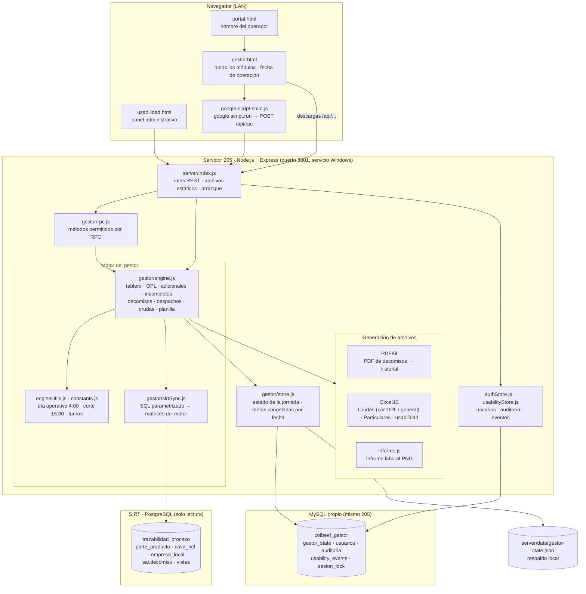

# Arquitectura general

[← Volver al índice](../README.md) · Fuente: [01-arquitectura.mmd](./01-arquitectura.mmd)

## Piezas

| Pieza | Qué hace |
|---|---|
| `gestor.html` | Interfaz única con todos los módulos. Llama al servidor con `google.script.run` (el shim lo convierte en `POST /api/rpc`) y descarga archivos por rutas `/api/...`. |
| `server/index.js` | Express en el puerto 3001: rutas REST, archivos estáticos y arranque (espera a MySQL). |
| `gestor/rpc.js` | Lista blanca de métodos que puede invocar la interfaz; los que cambian estado quedan en la auditoría. |
| `gestor/engine.js` | Reglas de negocio: tablero, progreso OPL, adicionales, incompletos, decomisos, despachos, crudas, planilla. |
| `gestor/sirtSync.js` | Consultas SQL a SIRT (solo lectura) y conversión a las matrices del motor. |
| `gestor/store.js` | Estado de la jornada y metas congeladas por fecha/turno. Guarda en MySQL y deja respaldo en JSON. |
| MySQL `colbeef_gestor` | Base propia del gestor en el 205: estado, usuarios, auditoría, usabilidad y bloqueo de sesión. |
| SIRT PostgreSQL | Fuente de datos operativos. El gestor nunca escribe en ella (`POSTGRES_READ_ONLY=true`). |
