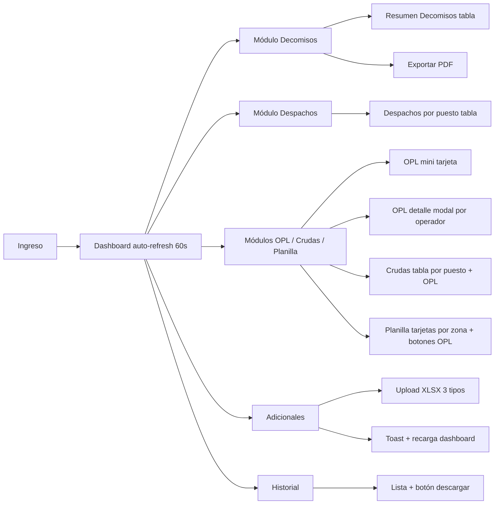

# Mapa de pantallas

[← Volver al índice](../README.md) · Fuente: [03-mapa-pantallas.mmd](./03-mapa-pantallas.mmd)

```mermaid
flowchart LR
  login[Ingreso] --> dash[Dashboard auto-refresh 60s]

  dash --> decomisos[Módulo Decomisos]
  dash --> despachos[Módulo Despachos]
  dash --> opl[Módulos OPL / Crudas / Planilla]
  dash --> adicionales[Adicionales]
  dash --> historial[Historial]

  decomisos --> decomisos_tab[Resumen Decomisos tabla]
  decomisos --> decomisos_pdf[Exportar PDF]

  despachos --> despachos_tab[Despachos por puesto tabla]

  opl --> opl_mini[OPL mini tarjeta]
  opl --> opl_modal[OPL detalle modal por operador]
  opl --> crudas_tab[Crudas tabla por puesto + OPL]
  opl --> planilla_cards[Planilla tarjetas por zona + botones OPL]

  adicionales --> adicionales_upload[Upload XLSX 3 tipos]
  adicionales --> adicionales_toast[Toast + recarga dashboard]

  historial --> historial_list[Lista + botón descargar]
```
