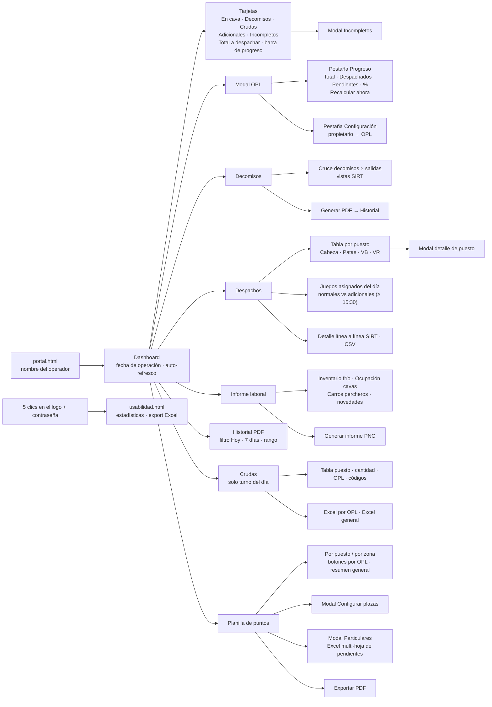

# Mapa de pantallas

[← Volver al índice](../README.md) · Fuente: [03-mapa-pantallas.mmd](./03-mapa-pantallas.mmd)

Todas las pantallas viven en `gestor.html`; cada módulo tiene el botón **← Volver al Dashboard**.

