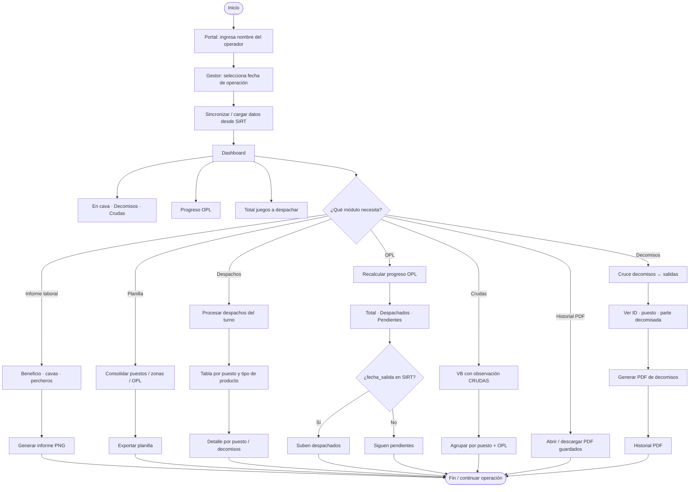
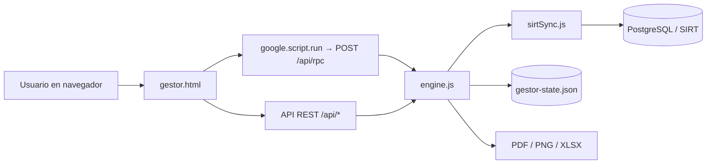

# Flujo operativo del Gestor de Vísceras

[← Volver al índice](../README.md) · Fuente: [04-flujo-operativo.mmd](./04-flujo-operativo.mmd)

Diagrama de flujo de **cómo se usa el programa** en el día a día.

## Cómo se mueve la información (técnico)

## Flujo recomendado en planta

1. Entrar por el portal con el nombre del operador.
2. Elegir la fecha de operación.
3. Cargar / sincronizar SIRT.
4. Revisar el dashboard.
5. Abrir **Decomisos** y validar.
6. Abrir **Despachos** y procesar el turno.
7. Recalcular **OPL**.
8. Consultar **Crudas** / **Planilla** si aplica.
9. Generar **Informe laboral** y PDF.
10. Descargar desde **Historial PDF**.
