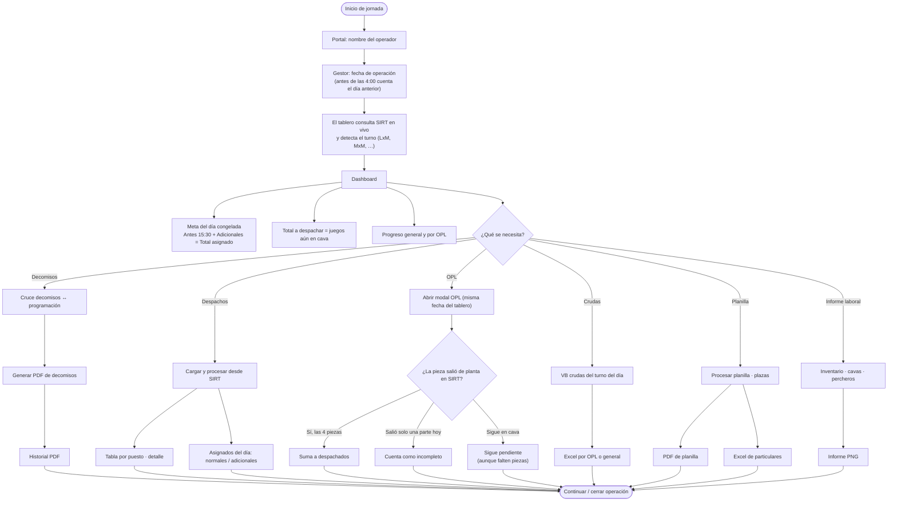

# Flujo operativo del Gestor de Vísceras

[← Volver al índice](../README.md) · Fuente: [04-flujo-operativo.mmd](./04-flujo-operativo.mmd)

Cómo se usa el programa en el día a día.

```mermaid
flowchart TD
  A([Inicio de jornada]) --> B["Portal: nombre del operador"]
  B --> C["Gestor: fecha de operación<br/>(antes de las 4:00 cuenta el día anterior)"]
  C --> D["El tablero consulta SIRT en vivo<br/>y detecta el turno (LxM, MxM, …)"]

  D --> E["Dashboard"]
  E --> E1["Meta del día congelada<br/>Antes 15:30 + Adicionales = Total asignado"]
  E --> E2["Total a despachar = juegos aún en cava"]
  E --> E3["Progreso general y por OPL"]

  E --> F{"¿Qué se necesita?"}

  F -->|Decomisos| G["Cruce decomisos ↔ programación"]
  G --> G1["Generar PDF de decomisos"]
  G1 --> N["Historial PDF"]

  F -->|Despachos| H["Cargar y procesar desde SIRT"]
  H --> H1["Tabla por puesto · detalle"]
  H --> H2["Asignados del día: normales / adicionales"]

  F -->|OPL| I["Abrir modal OPL (misma fecha del tablero)"]
  I --> I1{"¿La pieza salió de planta en SIRT?"}
  I1 -->|"Sí, las 4 piezas"| I2["Suma a despachados"]
  I1 -->|"Salió solo una parte hoy"| I3["Cuenta como incompleto"]
  I1 -->|"Sigue en cava"| I4["Sigue pendiente<br/>(aunque falten piezas)"]

  F -->|Crudas| J["VB crudas del turno del día"]
  J --> J1["Excel por OPL o general"]

  F -->|Planilla| K["Procesar planilla · plazas"]
  K --> K1["PDF de planilla"]
  K --> K2["Excel de particulares"]

  F -->|"Informe laboral"| L["Inventario · cavas · percheros"]
  L --> L1["Informe PNG"]

  N --> O([Continuar / cerrar operación])
  H1 --> O
  H2 --> O
  I2 --> O
  I3 --> O
  I4 --> O
  J1 --> O
  K1 --> O
  K2 --> O
  L1 --> O
```

## Flujo recomendado en planta

1. Entrar por el portal con el nombre del operador.
2. Revisar la **fecha de operación**. Antes de las 4:00 el gestor sigue en el día anterior.
3. Revisar el dashboard: meta del día, total a despachar, adicionales, incompletos y progreso OPL.
4. **Decomisos**: validar el cruce y generar el PDF (queda en el Historial).
5. **Despachos**: cargar y procesar desde SIRT; revisar los asignados del día (normales y adicionales).
6. **OPL**: abrir el modal; muestra la misma fecha del tablero. **Recalcular ahora** si se necesita al instante.
7. **Crudas**: revisar las del turno y descargar el Excel por OPL o el general.
8. **Planilla**: procesar, configurar plazas si hace falta, exportar PDF y Excel de particulares.
9. **Informe laboral**: completar y generar el PNG.

Para revisar un día anterior basta con cambiar la fecha: su meta congelada se conserva y no afecta la del día en curso.
