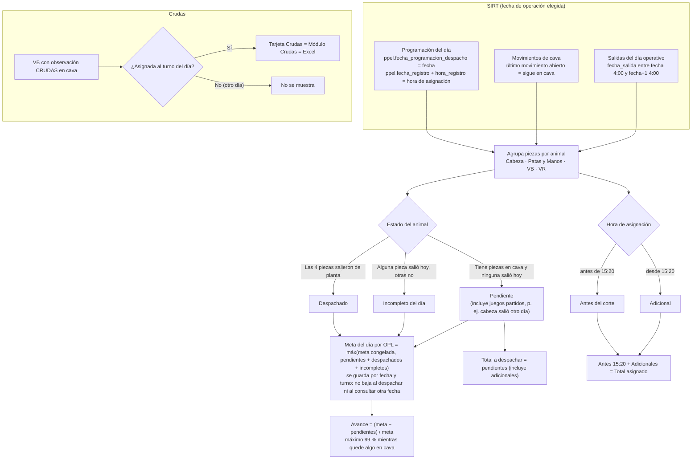

# Cálculo del progreso, adicionales, incompletos y crudas

[← Volver al índice](../README.md) · Fuente: [05-calculo-progreso.mmd](./05-calculo-progreso.mmd)

Cómo salen los números del tablero y del modal OPL (`construirProgresoOplDesdeDespachos` en `engine.js`).

## Reglas

| Concepto | Regla |
|---|---|
| Día operativo | Va de las 4:00 del día elegido a las 4:00 del día siguiente (`GESTOR_DIA_OPERATIVO_CORTE_HORA`). |
| Juego | Un animal con sus 4 piezas: Cabeza, Patas y Manos, Vísceras Blancas, Vísceras Rojas. |
| Adicional | Juego cuya salida se **asignó** (registro de la programación en SIRT) desde las 15:20 del día (`GESTOR_SALIDA_ADICIONAL_HORA/MINUTO`). No importa la hora de salida física. Una vez adicional, queda adicional. |
| Despachado | Las 4 piezas salieron de planta en el día operativo. Los traslados internos entre cavas no cuentan. |
| Incompleto | Salió alguna pieza del animal en el día, pero no las 4. |
| Pendiente | El animal tiene piezas asignadas que siguen en cava y ninguna salió hoy. Incluye juegos partidos (por ejemplo, la cabeza salió otro día y quedan las vísceras). |
| Meta del día | Máximo entre la meta congelada y `pendientes + despachados + incompletos`. Se guarda por fecha y turno (últimos 14 días): no baja al despachar ni al consultar otra fecha. |
| Total a despachar | Pendientes en cava, adicionales incluidos. |
| Avance | `(meta − pendientes) / meta`. Se queda en 99 % mientras haya algo en cava. |
| Crudas | VB con observación `CRUDAS` asignada al turno del día. La tarjeta, el módulo y los dos Excel usan el mismo criterio. |

Diagnóstico con datos reales: `node scripts/verificar-fechas-opl.mjs 2026-09-28 2026-09-29`
y `node scripts/probe-juego.mjs <animal>`.
